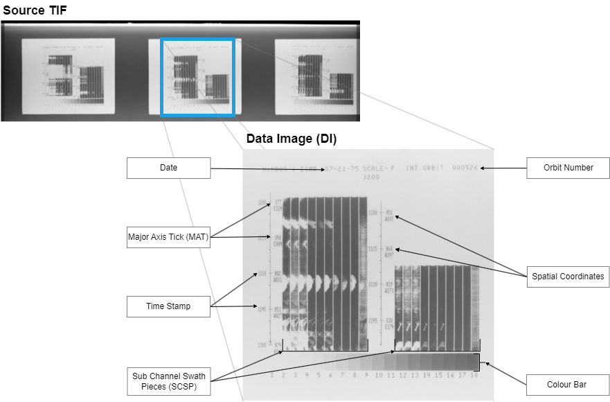
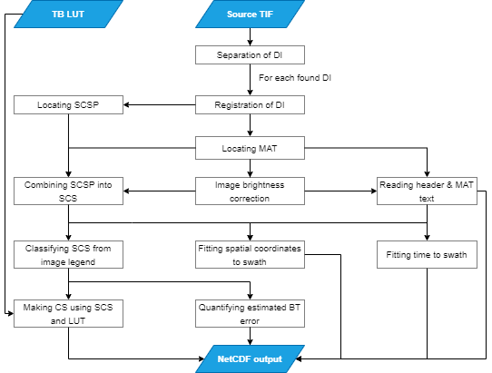

# The Nimbus 6 Electrically Scanning Microwave Radiometer: data rescue

## Motivation
The Nimbus 6 Electronic Microwave Radiometer (N6ESMR) was a Single frequency, 37 GHz, dual polarisation radiometer aboard the Nimbus 6 meteorological satellite and was active between June 22, 1975 and August 11, 1977. Its data is one of the few available sources for satellite sea ice monitoring, and might thus be used to expand the record of sea ice behavior if processed. However, the original level 1 radiance data were never archived, meaning that the only available data source is printed grayscale data images intended for manual analysis, which was stored on 70 mm film strips as both positives and negative. Scanned TIF images of these were made available in 2022 at the Goddard Earth Science Data Information and Services Center ([GES DISC](https://disc.gsfc.nasa.gov/datasets/ESMRN6IM_001/summary)).

## Data
Raw data is available at [GES DISC](https://disc.gsfc.nasa.gov/datasets/ESMRN6IM_001/summary) in both positive and negative TIF image format. To use with this repository, simply add all TIF files unpacked in the "negatives" or "positives" folder of the "data"-folder.

The processed data is available at ***[not available]*** and should match the outputs in ./outputs/*/final.

## Dependencies
Third party modules used for this project includes:
- Numpy
- Scipy
- Scikit-image
- datetime
- tqdm
- [pytesseract](https://pypi.org/project/pytesseract/)

Pytesseract is an optical character recognition (OCR) tool for python. In order to use, an installation of [Tesseract](https://tesseract-ocr.github.io/tessdoc/Installation.html) is needed, and needs to be properly referenced in the "projectFunctions.py" file.

## Usage
After raw TIF images are inserted correctly into the "data" folder, processing scripts must be used in the following order:

1. separateDI.py
2. allignDI.py
3. extractData.py

For each script, be sure to specify whether negatives or positives are to be processed. The 2 former scripts respectively separates DI from the raw TIF files, and alligns DI such that their geometry is directly comparable. Resulting PNGs are stored in the outputs folder. Scripts makes sure data is treated accordingly to the conventions of the time period of the image used. Error reports are saved in "reports", containing name of any files the algorithms could not handle.

***Be aware***: manual sorting is needed after running 1. and 2. Sorting includes removing images were frames have not been separated correctly after 1., and DI not proporly alligned with the majority of DI after 2..

## Image format
Raw TIF images makes up 2-3 data images DI, that each contains data regarding up to one orbit. Data included in the DI is separated into 2 sectors, left and right, which together makes up one continueous time series of observations. 10 swaths are displayed on the DI - 1,4 and 7 represents different brightness temperature ranges for the horizontal polarization of the signal, T_H - 2,5 and 8 is same for vertical T_V, 3,6 and 9 is and average of the 2, T_S, and finally, swath 10 is the difference T_D, quantified differently depending on time.

## Methods
Full method is illustrated in flowchart. Separation and registration of DI is handled in their own scripts due to the need of manual sorting. The final script deals with brightness correction, text reading, locating swaths, classyfying swaths using colorbar, and fitting geographic coordinates.

